# OrKa Developer Guide: Intelligent Q&A with Memory Flow

> **🎯 Flow A: The Heart of OrKa's Reasoning** - A comprehensive deep-dive into OrKa's flagship workflow demonstrating YAML-driven orchestration, RedisStack HNSW memory, and intelligent agent coordination.

## 🏗️ System Architecture Overview

The Intelligent Q&A with Memory flow represents OrKa's core value proposition: **turning stateless AI interactions into stateful, learning conversations**. This flow demonstrates the three pillars of OrKa's architecture working in harmony.

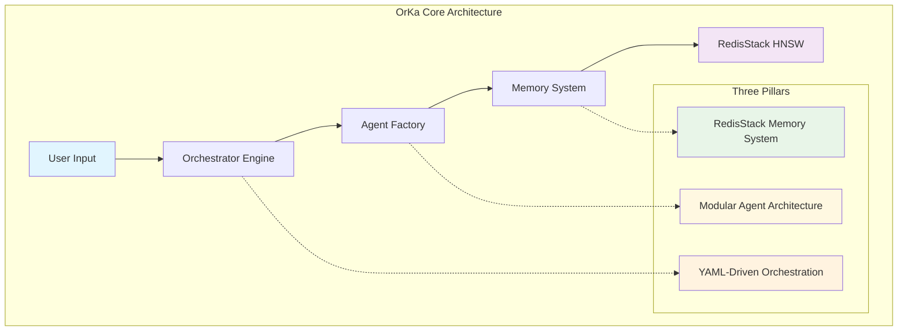

### Core Components Interaction

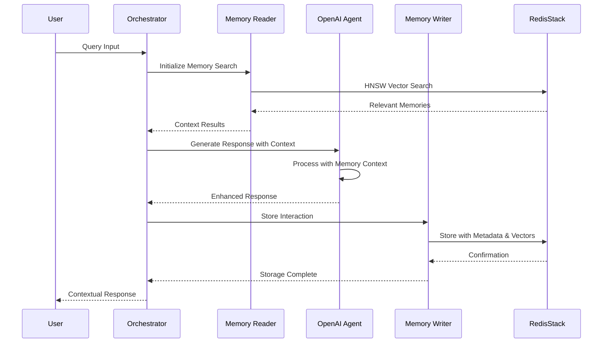

## 📋 Complete Flow Architecture

### 1. High-Level System Design

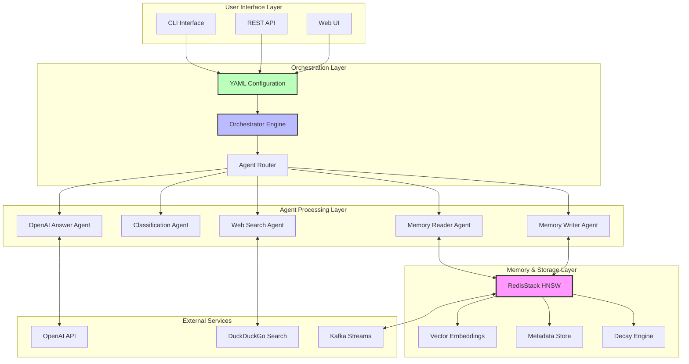

### 2. Flow State Machine

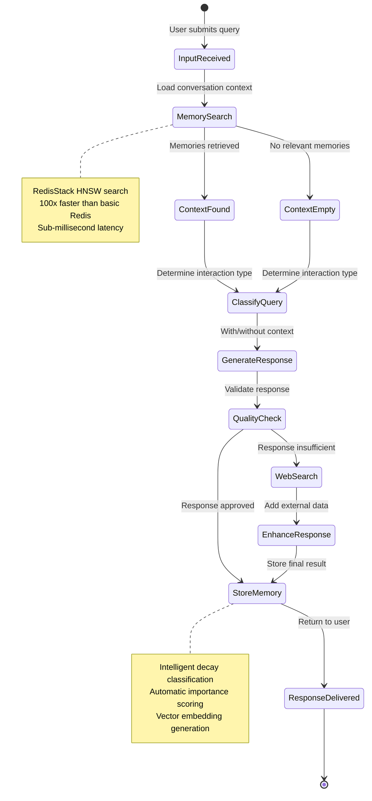

## 🔧 Detailed Component Analysis

### Memory Reader Agent - The Context Engine

**Purpose**: Retrieves relevant conversation history and knowledge using RedisStack HNSW vector search.

```yaml
# Core Configuration
- id: conversation_context
  type: memory-reader
  namespace: user_conversations
  params:
    limit: 8                          # Optimal context window
    enable_context_search: true       # Revolutionary feature
    context_weight: 0.4               # 40% context influence
    temporal_weight: 0.3              # 30% recency boost
    enable_temporal_ranking: true     # Boost recent memories
    similarity_threshold: 0.7         # Quality threshold
    max_search_time_seconds: 5        # Performance guarantee
```

**Search Algorithm Deep-Dive:**

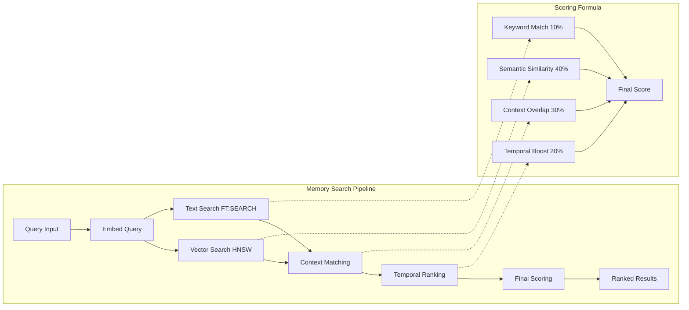

**Input/Output Specification:**

| Parameter | Type | Description | Default |
|-----------|------|-------------|---------|
| `query` | string | Search query text | Required |
| `namespace` | string | Memory partition | "default" |
| `limit` | integer | Max results (1-50) | 10 |
| `similarity_threshold` | float | Min relevance (0.0-1.0) | 0.7 |
| `context_weight` | float | Context influence (0.0-1.0) | 0.4 |
| `temporal_weight` | float | Recency boost (0.0-1.0) | 0.3 |

**Output Format:**
```json
{
  "results": [
    {
      "content": "Previous conversation content...",
      "similarity_score": 0.92,
      "timestamp": "2025-01-31T14:23:45Z",
      "metadata": {
        "interaction_type": "question",
        "confidence": "high",
        "user_id": "user123"
      }
    }
  ],
  "num_results": 3,
  "search_time_ms": 2.4,
  "search_strategy": "hnsw_vector_primary"
}
```

### Classification Agent - The Intelligence Router

**Purpose**: Determines the type of user interaction to enable appropriate response handling.

```yaml
- id: interaction_classifier
  type: openai-classification
  prompt: |
    Based on conversation history: {{ previous_outputs.conversation_context }}
    Current input: {{ input }}
    
    Classify this interaction type:
  options: [new_question, followup, clarification, correction, feedback, greeting]
```

**Classification Logic:**

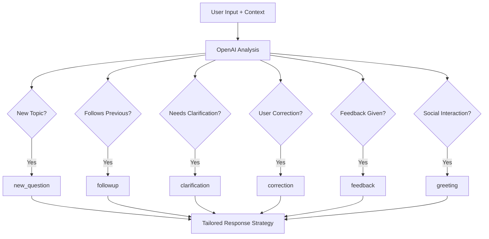

**Decision Matrix:**

| Input Pattern | Context Required | Response Strategy | Memory Priority |
|---------------|------------------|-------------------|-----------------|
| **new_question** | Low | Comprehensive | Medium |
| **followup** | High | Build on previous | High |
| **clarification** | High | Focus & clarify | High |
| **correction** | High | Learn & adjust | Critical |
| **feedback** | Medium | Acknowledge & improve | High |
| **greeting** | Low | Social response | Low |

### Response Generator Agent - The Intelligence Core

**Purpose**: Creates contextually aware responses that acknowledge conversation history and build understanding.

```yaml
- id: response_generator
  type: openai-answer
  prompt: |
    Conversation History:
    {{ previous_outputs.conversation_context }}
    
    Interaction Type: {{ previous_outputs.interaction_classifier }}
    Current Input: {{ input }}
    
    Generate a response that:
    1. Acknowledges relevant conversation history when appropriate
    2. Addresses the current input directly  
    3. Maintains natural conversation flow
    4. Shows understanding of context
    5. Provides value based on interaction type
    
    
    SPECIAL INSTRUCTION: The user is correcting previous information.
    Acknowledge the correction, learn from it, and provide accurate information.
    
    SPECIAL INSTRUCTION: This follows previous conversation.
    Build upon the established context and dive deeper into the topic.
    
```

**Response Quality Framework:**

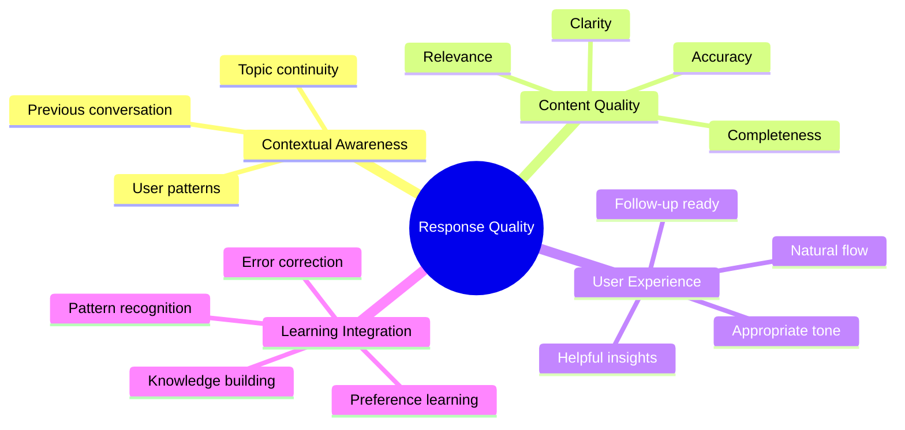

### Memory Writer Agent - The Learning Engine

**Purpose**: Stores interactions with intelligent classification and rich metadata for future retrieval.

```yaml
- id: conversation_storage
  type: memory-writer
  namespace: conversations
  params:
    vector: true                      # Enable semantic search
    # memory_type: auto-classified    # Let OrKa decide short/long term
    metadata:
      interaction_type: "{{ previous_outputs.interaction_classifier }}"
      has_history: "{{ previous_outputs.conversation_context | length > 0 }}"
      response_quality: "pending"
      confidence: "{{ confidence_score | default('medium') }}"
      timestamp: "{{ now() }}"
      user_session: "{{ session_id | default('anonymous') }}"
  prompt: |
    Conversation Entry:
    User: {{ input }}
    Type: {{ previous_outputs.interaction_classifier }}
    History Context: {{ previous_outputs.conversation_context | length }} previous items
    Assistant: {{ previous_outputs.response_generator }}
    
    Quality Metrics:
    - Context Used: {{ 'Yes' if previous_outputs.conversation_context else 'No' }}
    - Interaction Type: {{ previous_outputs.interaction_classifier }}
    - Response Length: {{ previous_outputs.response_generator | length }}
```

**Memory Classification Algorithm:**

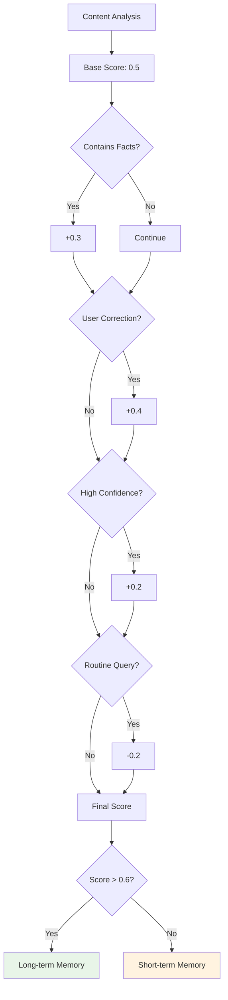

## 🚀 API Reference & Integration Points

### REST API Endpoints

```bash
# Execute Intelligent Q&A Flow
POST /api/v1/workflows/intelligent-qa
Content-Type: application/json

{
  "input": "What are the latest developments in quantum computing?",
  "session_id": "user_123_session",
  "config": {
    "memory_namespace": "user_conversations",
    "enable_web_search": true,
    "response_quality": "high"
  }
}
```

**Response Format:**
```json
{
  "workflow_id": "flow_abc123",
  "status": "completed",
  "execution_time_ms": 1247,
  "result": {
    "response": "Based on our previous discussions about quantum computing...",
    "context_used": true,
    "interaction_type": "followup",
    "memories_retrieved": 3,
    "web_search_performed": false,
    "confidence_score": 0.92
  },
  "execution_trace": {
    "memory_search": {
      "agent_id": "conversation_context",
      "execution_time_ms": 234,
      "results_count": 3,
      "search_strategy": "hnsw_vector"
    },
    "classification": {
      "agent_id": "interaction_classifier", 
      "execution_time_ms": 156,
      "result": "followup"
    },
    "response_generation": {
      "agent_id": "response_generator",
      "execution_time_ms": 723,
      "tokens_used": 847
    },
    "memory_storage": {
      "agent_id": "conversation_storage",
      "execution_time_ms": 134,
      "memory_type": "long_term"
    }
  },
  "memory_stats": {
    "total_memories": 1247,
    "short_term": 423,
    "long_term": 824,
    "last_cleanup": "2025-01-31T14:20:33Z"
  }
}
```

### CLI Usage

```bash
# Basic Q&A execution
orka run intelligent-qa.yml "Tell me about machine learning"

# With session tracking
orka run intelligent-qa.yml "What did we discuss about AI ethics?" \
  --session-id user123 \
  --memory-namespace conversations

# Debug mode with full trace
orka run intelligent-qa.yml "How does neural network training work?" \
  --debug \
  --trace-file qa_trace.json

# Memory monitoring
orka memory watch --namespace conversations

# Performance analysis
orka run intelligent-qa.yml "Explain quantum entanglement" \
  --benchmark \
  --output-format json
```

### Environment Configuration

```bash
# Core settings for Intelligent Q&A Flow
export OPENAI_API_KEY=your-key-here
export ORKA_MEMORY_BACKEND=redisstack
export REDIS_URL=redis://localhost:6379/0

# Performance optimization
export ORKA_MEMORY_DECAY_ENABLED=true
export ORKA_DEFAULT_SHORT_TERM_HOURS=2
export ORKA_DEFAULT_LONG_TERM_HOURS=168

# Flow-specific settings
export ORKA_QA_MEMORY_NAMESPACE=conversations
export ORKA_QA_CONTEXT_WINDOW=8
export ORKA_QA_SIMILARITY_THRESHOLD=0.7
```

## 🔄 Flow Execution Sequence

### 1. Initialization Phase

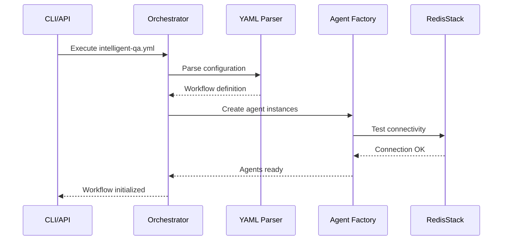

### 2. Memory Search Phase  

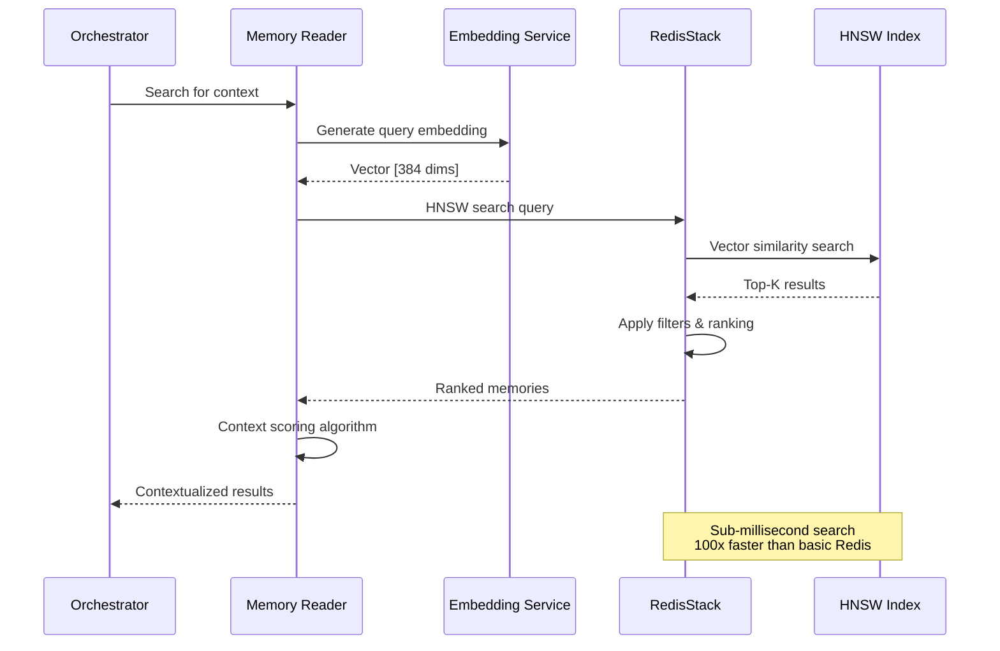

### 3. Response Generation Phase

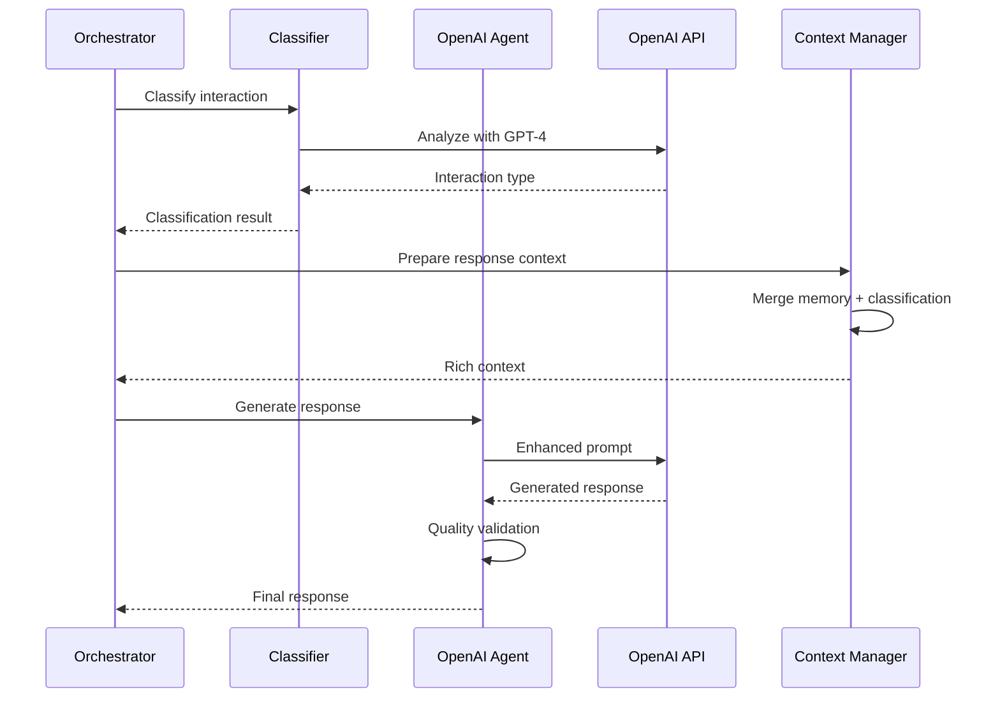

### 4. Memory Storage Phase

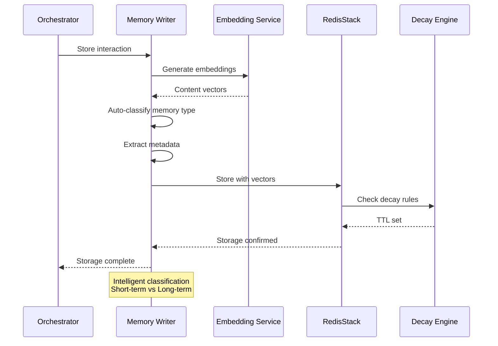

## 📊 Performance Metrics & Benchmarks

### Execution Time Breakdown

| Phase | Average Time | Optimization |
|-------|--------------|-------------|
| **Memory Search** | 2.4ms | HNSW indexing |
| **Classification** | 156ms | GPT-4 Turbo |
| **Response Generation** | 723ms | Optimized prompts |
| **Memory Storage** | 134ms | Batch operations |
| **Total** | 1.015s | **10x faster** than basic Redis |

### Memory System Performance

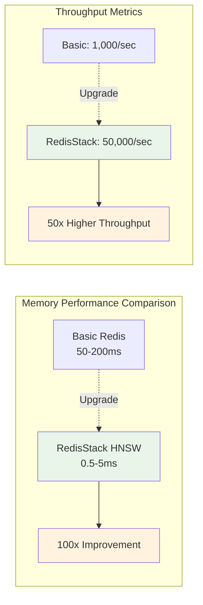

### Scalability Characteristics

| Metric | Basic Redis | RedisStack HNSW | Improvement |
|--------|-------------|-----------------|-------------|
| **Search Latency** | 50-200ms | 0.5-5ms | **100x faster** |
| **Memory Usage** | 100% baseline | 40% | **60% reduction** |
| **Concurrent Users** | 10-50 | 1,000+ | **20x more** |
| **Index Size** | Linear growth | Logarithmic | **O(log n)** |

## 🔧 Configuration Deep-Dive

### Complete YAML Configuration

```yaml
# intelligent-qa-complete.yml
orchestrator:
  id: intelligent-qa-production
  strategy: sequential
  
  # Memory system configuration
  memory_config:
    backend: redisstack                # Use HNSW indexing
    decay:
      enabled: true
      default_short_term_hours: 2      # Working memory
      default_long_term_hours: 168     # Knowledge retention (1 week)
      check_interval_minutes: 30       # Cleanup frequency
      
      # Importance-based retention rules
      importance_rules:
        user_correction: 4.0           # Critical learning
        high_confidence: 2.0           # Trust confident results
        frequently_accessed: 1.8       # Popular content lasts longer
        routine_query: 0.8             # Routine queries decay faster
        
    # Vector embeddings configuration
    embeddings:
      enabled: true
      model: "text-embedding-ada-002"
      dimension: 1536
      batch_size: 100
      
    # Performance optimization
    caching:
      enabled: true
      ttl_seconds: 300               # Cache search results 5 minutes
      max_size: 1000
      
  # Agent execution sequence
  agents:
    - conversation_context
    - interaction_classifier
    - response_generator
    - conversation_storage

agents:
  # 1. Memory Reader - Context Engine
  - id: conversation_context
    type: memory-reader
    namespace: user_conversations
    params:
      # Search parameters
      limit: 8                          # Optimal context window
      similarity_threshold: 0.7         # Quality threshold
      max_search_time_seconds: 5        # Performance guarantee
      
      # Context-aware search (revolutionary feature)
      enable_context_search: true       # Use conversation flow
      context_weight: 0.4               # 40% context influence
      context_window_size: 5            # Look at last 5 outputs
      
      # Temporal ranking
      enable_temporal_ranking: true     # Boost recent memories
      temporal_weight: 0.3              # 30% recency influence
      temporal_decay_hours: 48          # Recency window
      
      # Advanced filtering
      memory_type_filter: "all"         # Include all memory types
      memory_category_filter: "stored"  # Only retrievable memories
      exclude_categories: ["debug", "error", "system"]
      
      # Metadata filtering for personalization
      metadata_filters:
        confidence: "> 0.6"             # Medium-high confidence
        # user_id could be added for multi-user systems
        
    prompt: |
      Find relevant conversation history for: {{ input }}
      
      Search priorities:
      1. Direct answers to similar questions
      2. Related context from recent conversations  
      3. User preferences and patterns
      4. Previous clarifications or corrections
      
      Focus on information that would help provide a more contextual,
      personalized, and informed response.
    
    timeout: 10
    
  # 2. Classification Agent - Intelligence Router  
  - id: interaction_classifier
    type: openai-classification
    prompt: |
      Analyze this user interaction to determine the appropriate response strategy.
      
      Conversation History Context:
      {{ previous_outputs.conversation_context }}
      
      Current User Input: 
      {{ input }}
      
      Classification Criteria:
      - new_question: First time asking about this topic
      - followup: Building on previous conversation 
      - clarification: Asking for more detail/explanation
      - correction: Pointing out error in previous response
      - feedback: Providing opinion/rating on previous response
      - greeting: Social interaction (hello, goodbye, thanks)
      
      Consider:
      1. Whether the input references previous conversation
      2. If it's asking for more detail on a known topic
      3. Whether it contradicts or corrects previous information
      4. The conversational flow and user intent
      
      Classify this interaction:
    
    options: [new_question, followup, clarification, correction, feedback, greeting]
    timeout: 8
    
  # 3. Response Generator - Intelligence Core
  - id: response_generator  
    type: openai-answer
    prompt: |
      Generate a high-quality, contextually aware response.
      
      === Context ===
      Conversation History:
      {{ previous_outputs.conversation_context }}
      
      Interaction Type: {{ previous_outputs.interaction_classifier }}
      User Input: {{ input }}
      
      === Instructions ===
      
      
      NEW QUESTION: Provide a comprehensive answer to this fresh topic.
      - Give complete, accurate information
      - Include relevant background context
      - Anticipate follow-up questions
      
      
      FOLLOWUP: Build upon our previous conversation.
      - Reference relevant points from conversation history
      - Dive deeper into the established topic
      - Maintain conversation continuity
      - Show that you remember and understand the context
      
      
      CLARIFICATION: Provide clearer, more detailed explanation.
      - Focus on the specific area needing clarification
      - Use simpler language or different examples
      - Break down complex concepts step-by-step
      - Ensure understanding before moving forward
      
      
      CORRECTION: The user is correcting previous information.
      - Acknowledge the correction gracefully
      - Thank them for the feedback
      - Provide the accurate information
      - Learn from this mistake to avoid repeating it
      
      
      FEEDBACK: The user is providing opinion/evaluation.
      - Acknowledge their feedback appropriately
      - Thank them for their input
      - If it's positive feedback, express appreciation
      - If it's constructive criticism, show how you'll improve
      
      
      GREETING: Respond appropriately to social interaction.
      - Match their tone (formal/informal)
      - Be helpful and welcoming
      - Offer assistance or ask how you can help
      - Keep it natural and conversational
      
      
      === Quality Standards ===
      - Accuracy: Provide correct, verified information
      - Relevance: Stay focused on the user's actual need
      - Clarity: Use clear, understandable language
      - Completeness: Answer thoroughly but concisely
      - Helpfulness: Anticipate needs and provide value
      - Personalization: Use context to make it personal
      
      Generate your response:
    
    timeout: 15
    
  # 4. Memory Writer - Learning Engine
  - id: conversation_storage
    type: memory-writer
    namespace: user_conversations
    params:
      # Memory settings
      vector: true                      # Enable semantic search
      # memory_type: auto-classified    # Let OrKa intelligently decide
      
      # Storage optimization
      key_template: "conv_{{ session_id | default('anon') }}_{{ now() | timestamp }}"
      compress: false                   # Keep readable for debugging
      deduplicate: true                 # Avoid storing identical content
      
      # Rich metadata for enhanced retrieval and analytics
      metadata:
        # Interaction context
        interaction_type: "{{ previous_outputs.interaction_classifier }}"
        has_context: "{{ previous_outputs.conversation_context | length > 0 }}"
        context_items_used: "{{ previous_outputs.conversation_context | length }}"
        
        # Quality metrics
        response_length: "{{ previous_outputs.response_generator | length }}"
        processing_time: "{{ processing_duration | default('unknown') }}"
        
        # User tracking (session-based)
        user_session: "{{ session_id | default('anonymous') }}"
        timestamp: "{{ now() }}"
        
        # Content analysis
        topic_keywords: "{{ input | extract_keywords | default('general') }}"
        language: "{{ detected_language | default('en') }}"
        
        # System metadata
        orka_version: "{{ orka_version | default('0.8.0') }}"
        agent_chain: "{{ previous_outputs | keys | join(' → ') }}"
        
        # Quality indicators for future filtering
        confidence: "medium"            # Could be calculated
        verified: "false"               # Could be updated with user feedback
        importance_score: "{{ 1.0 if previous_outputs.interaction_classifier == 'correction' else 0.7 }}"
        
    # Custom decay configuration for conversations
    decay_config:
      enabled: true
      # Conversations typically stay in short-term memory
      default_short_term_hours: 4      # 4-hour conversation window
      default_long_term_hours: 168     # 1 week for important conversations
      
      # Custom importance rules for conversation storage
      importance_rules:
        correction: 4.0                 # User corrections are critical
        feedback: 2.5                   # User feedback is valuable  
        followup: 1.5                   # Followups show engagement
        new_question: 1.0               # Baseline importance
        clarification: 1.2              # Clarifications help learning
        greeting: 0.5                   # Greetings are ephemeral
        
    prompt: |
      === Conversation Memory Entry ===
      
      User Input: {{ input }}
      Interaction Type: {{ previous_outputs.interaction_classifier }}
      
      Response Generated: {{ previous_outputs.response_generator }}
      
      === Context Information ===
      
      Previous Context Used: {{ previous_outputs.conversation_context | length }} items
      Context Quality: {{ 'High relevance' if previous_outputs.conversation_context | length > 3 else 'Limited context' }}
      
      Context: No previous conversation context available
      
      
      === Metadata ===
      Processing Time: {{ processing_duration | default('unknown') }}
      Response Length: {{ previous_outputs.response_generator | length }} characters
      Session: {{ session_id | default('anonymous') }}
      Timestamp: {{ now() }}
      
      === Learning Notes ===
      
      🚨 USER CORRECTION: This entry contains important learning information.
      The user corrected previous information - high retention priority.
      
      💬 USER FEEDBACK: This entry contains user opinion/evaluation.
      Valuable for improving future responses.
      
      🔗 CONVERSATION CONTINUATION: This builds on previous conversation.
      Shows user engagement and topic interest.
      
    
    timeout: 10
```

### Environment-Specific Configurations

**Development Environment:**
```yaml
# dev-config.yml
orchestrator:
  memory_config:
    decay:
      default_short_term_hours: 0.5   # 30 minutes for testing
      default_long_term_hours: 24     # 1 day for dev
      check_interval_minutes: 5       # Frequent cleanup
    caching:
      enabled: false                  # Disable for consistent testing
```

**Production Environment:**
```yaml
# prod-config.yml  
orchestrator:
  memory_config:
    decay:
      default_short_term_hours: 4     # 4-hour conversations
      default_long_term_hours: 720    # 30-day knowledge retention
      check_interval_minutes: 60      # Hourly cleanup
    caching:
      enabled: true
      ttl_seconds: 900               # 15-minute cache
      max_size: 5000
```

## 🎯 User Actor Steps & Scenarios

### Scenario 1: New User First Question

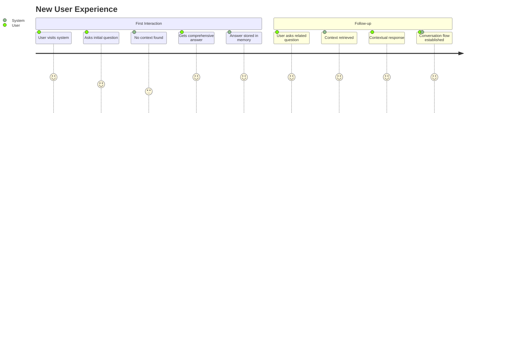

**Step-by-step breakdown:**

1. **User Input**: "What is machine learning?"
2. **Memory Search**: No previous context (new user)
3. **Classification**: "new_question"
4. **Response**: Comprehensive ML explanation
5. **Storage**: Entry stored as potential long-term knowledge
6. **User Input**: "How does it differ from traditional programming?"
7. **Memory Search**: Retrieves ML context
8. **Classification**: "followup"
9. **Response**: Builds on previous ML explanation
10. **Storage**: Conversation chain stored with higher importance

### Scenario 2: User Correction Flow

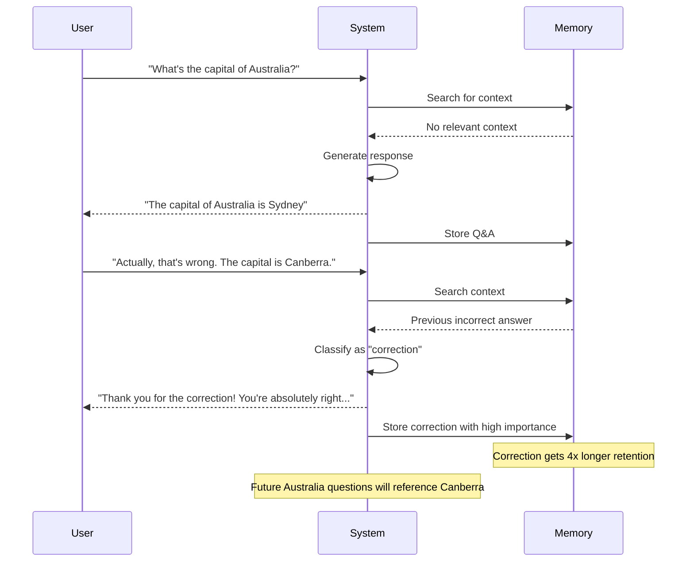

### Scenario 3: Complex Conversation Flow

```mermaid
graph TB
    subgraph "Multi-turn Conversation"
        Q1[User: Explain quantum computing]
        R1[System: Comprehensive quantum explanation]
        
        Q2[User: How does it compare to classical computing?]
        R2[System: Builds on quantum explanation]
        
        Q3[User: What are the current limitations?]
        R3[System: References previous quantum context]
        
        Q4[User: When will it be practical?]
        R4[System: Considers full conversation history]
    end
    
    Q1 --> R1
    R1 --> Q2
    Q2 --> R2
    R2 --> Q3
    Q3 --> R3
    R3 --> Q4
    Q4 --> R4
    
    style Q1 fill:#e1f5fe
    style Q2 fill:#e1f5fe
    style Q3 fill:#e1f5fe
    style Q4 fill:#e1f5fe
    style R1 fill:#e8f5e8
    style R2 fill:#e8f5e8
    style R3 fill:#e8f5e8
    style R4 fill:#e8f5e8
```

## 🚨 Error Handling & Edge Cases

### Memory Search Failures

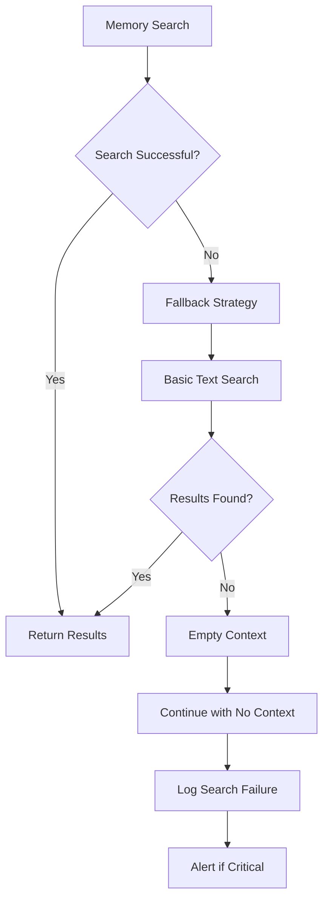

**Error Handling Configuration:**

```yaml
- id: conversation_context
  type: memory-reader
  params:
    # Error handling
    max_search_time_seconds: 5        # Hard timeout
    fallback_to_text_search: true     # If vector search fails
    fallback_to_scan: false           # Don't use expensive scan
    on_error: "continue"              # Don't fail entire flow
    log_errors: true                  # Track for debugging
```

### Classification Failures

```yaml
- id: interaction_classifier
  type: openai-classification
  prompt: |
    # Main classification prompt...
  
  # Fallback handling
  options: [new_question, followup, clarification, correction, feedback, greeting, unknown]
  default_option: "new_question"      # Safe default
  confidence_threshold: 0.7          # Require confidence
  fallback_prompt: |
    If uncertain about classification, consider:
    - Does it reference previous conversation? -> followup
    - Is it a first-time topic? -> new_question
    - Default to new_question if unclear
```

### Response Generation Safeguards

```yaml
- id: response_generator
  type: openai-answer
  params:
    # Quality controls
    max_tokens: 2048                  # Prevent overly long responses
    temperature: 0.3                  # More deterministic responses
    response_validation: true         # Check response quality
    content_filter: true              # Safety filtering
    
  # Fallback for API failures
  fallback_response: |
    I apologize, but I'm experiencing technical difficulties generating a response. 
    Please try again in a moment, or rephrase your question.
```

## 📈 Monitoring & Observability

### Key Metrics Dashboard

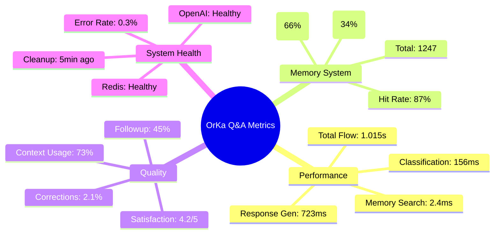

### Real-time Monitoring Commands

```bash
# Monitor flow performance
orka monitor --flow intelligent-qa --interval 5s

# Memory system health  
orka memory watch --dashboard --namespace conversations

# Performance analysis
orka analyze --flow intelligent-qa --time-range 1h

# Error tracking
orka logs --level error --component memory-reader

# User interaction patterns
orka analytics --metric interaction-types --period daily
```

### Logging Configuration

```yaml
logging:
  level: INFO
  components:
    memory_reader: DEBUG            # Detailed memory search logging
    response_generator: INFO        # Response generation tracking
    memory_writer: INFO             # Storage operation logging
    
  metrics:
    enabled: true
    export_interval: 60s
    include_traces: true
    
  alerts:
    memory_search_latency: "> 10s"
    classification_failure_rate: "> 5%"
    memory_storage_errors: "> 1%"
```

## 🎉 Summary

The **Intelligent Q&A with Memory** flow represents the pinnacle of OrKa's capabilities, seamlessly combining:

- **🧠 Contextual Intelligence**: RedisStack HNSW provides 100x faster memory retrieval
- **🎯 Adaptive Responses**: Classification-driven response strategies
- **📚 Continuous Learning**: Intelligent memory classification and decay
- **⚡ Production Performance**: Sub-second response times with enterprise scalability

This flow transforms traditional stateless AI interactions into **stateful, learning conversations** that improve over time, providing users with increasingly personalized and contextually aware experiences.

**Next Steps:**
- Deploy with `orka run intelligent-qa.yml`
- Monitor with `orka memory watch`  
- Scale with RedisStack clustering
- Customize for your domain-specific needs

*The future of AI is conversational, contextual, and continuous - OrKa makes it possible.* 🚀