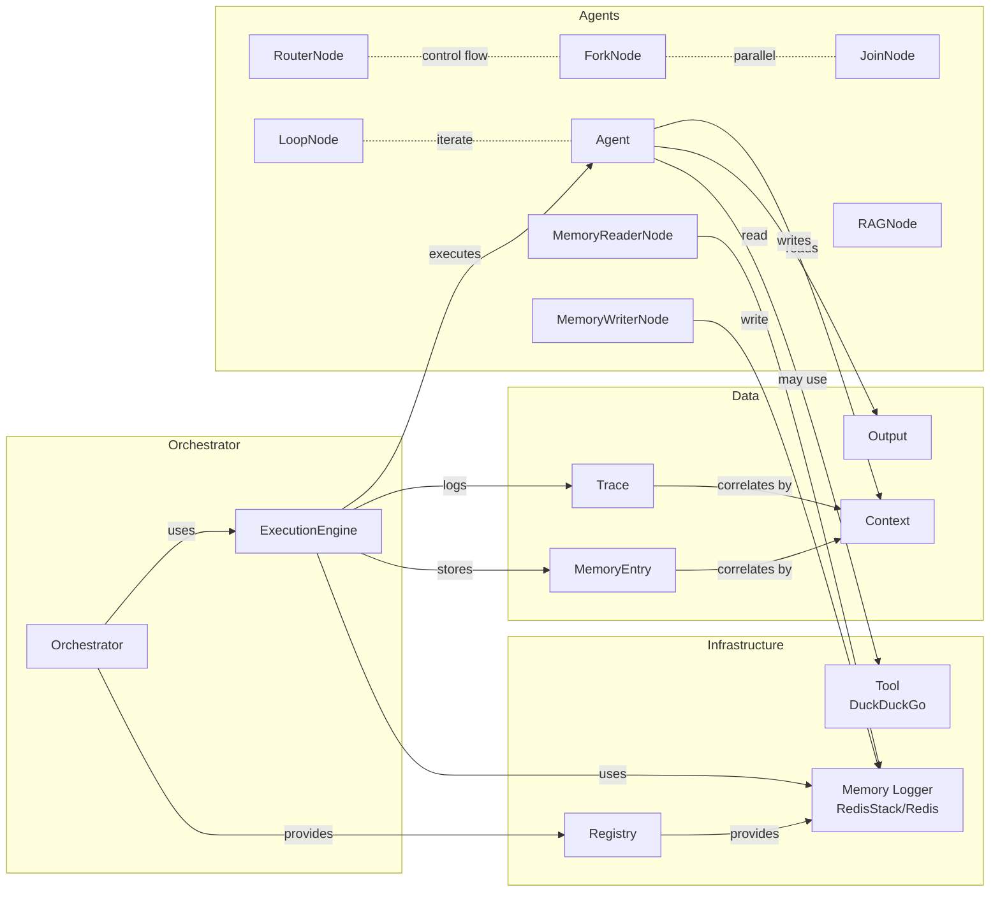

# OrKa Ontology

Purpose: a precise, implementation-aligned vocabulary of entities, identifiers, and relationships that define how OrKa orchestrates agents, memory, and execution. This document maps conceptual entities to concrete data structures and modules in the repository.

## Scope and Goals

- Establish shared names for core entities and links between them
- Align documentation with concrete types in `orka/contracts.py` and runtime behavior in `orka/orchestrator/*` and `orka/memory/*`
- Define identifiers, controlled vocabularies, and lifecycle events used across OrKa

## Core Entities

- Orchestrator: top-level controller of workflow execution
  - Implements: `orka/orchestrator/base.py`, `orka/orchestrator/execution_engine.py`
  - Responsibilities: agent queue management, context construction, error handling, metrics, prompt rendering

- ExecutionEngine: orchestrator runtime that executes the configured workflow
  - Implements: `orka/orchestrator/execution_engine.py`
  - Relationships: uses Memory Logger, coordinates Agents and Nodes, emits Trace events

- Agent: a processing unit that reads Context and emits Output
  - Base: `orka/agents/base_agent.py`
  - Examples: `BinaryAgent`, `ClassificationAgent`, `ValidationAndStructuringAgent`, `LocalLLMAgent`, OpenAI-based agents
  - Special Node-Agents (control flow): `ForkNode`, `JoinNode`, `RouterNode`, `LoopNode`, `FailoverNode`, `FailingNode`, `RAGNode`
  - Memory Agents: special `type: memory` agents that handle memory operations based on configuration

- Memory Agent: intelligent agent (`type: memory`) for memory operations
  - Implementation: Dynamically creates `MemoryReaderNode` or `MemoryWriterNode` based on `config.operation`
  - Operations: 
    - `operation: read` → Creates `MemoryReaderNode` for semantic search and retrieval
    - `operation: write` → Creates `MemoryWriterNode` for storage with vector embeddings
  - Features: Vector search, automatic memory classification, decay management, namespace organization
  - Configuration: Supports operation-aware memory presets with automatic read/write optimization (sensory, working, episodic, semantic, procedural, meta)

- Tool: helper capability used by Agents (e.g., web search)
  - Example: `DuckDuckGoTool` in `orka/tools/search_tools.py`

- Memory Logger: persistent storage and search for memories and orchestration logs
  - Implementations: `RedisStackMemoryLogger`, `RedisMemoryLogger`
  - Concerns: serialization, decay, vector search, namespaces, categories

- Registry: runtime resource registry (LLM, embedder, memory, tools)
  - Type: `Registry` (see `orka/contracts.py`)


## Data Contracts (authoritative types)

Defined in `orka/contracts.py`.

- Context: primary payload flowing between Agents
  - Fields: `input: str`, `previous_outputs: dict`, `metadata: dict`, `trace_id: Optional[str]`, `timestamp: datetime`, `formatted_prompt: Optional[str]`

- Output: standardized result of Agent execution
  - Fields: `result: Any`, `status: str` ("success" | "error"), `error: Optional[str]`, `metadata: dict`

- Trace: execution trace unit for auditing and monitoring
  - Fields: `v: int`, `trace_id: str`, `agent_id: str`, `timestamp: datetime`, `input: dict`, `output: dict`, `metadata: dict`

- MemoryEntry: stored knowledge or orchestration log entry
  - Fields: `content: str`, `importance: float`, `timestamp: datetime`, `metadata: dict`, `is_summary: bool`, `category: Optional[str]`

- ResourceConfig / Registry: resource types and instances for runtime

## Identifiers and Namespaces

- run_id: unique identifier for an orchestrator run/session
- trace_id: correlates all Memory/Trace items for a run; often equals run_id
- agent_id: unique identifier of an Agent/Node within the workflow
- fork_group_id: correlates parallel branches created by `ForkNode`
- memory key (RedisStack): `orka_memory:{uuid}`
- namespace: logical grouping for stored memories (e.g., conversation or knowledge domain)

## Controlled Vocabularies

- Output.status: `"success"`, `"error"`
- Memory types: `short_term`, `long_term` (classification done by memory logger)
- Categories: `stored` (knowledge) vs `log` (orchestration events)
- Log types (metadata.log_type): `memory` (stored knowledge) or `log` (events)
- Memory operations: `read` (search/retrieval), `write` (storage/persistence)
- Memory presets: `sensory`, `working`, `episodic`, `semantic`, `procedural`, `meta` (Minsky-inspired cognitive types with operation-specific defaults)

## Relationships

- Orchestrator executes Agents in a queue; some Agents are Nodes that control flow
- ExecutionEngine constructs Context for each Agent using `input` and `previous_outputs`
- Agent produces Output; Orchestrator updates `previous_outputs` and decides next steps
- Memory Logger records events and stored knowledge as MemoryEntry
- Tools are invoked by Agents within their implementation

## Lifecycle and Event Flow

1. Initialization: Orchestrator loads YAML, constructs Agents and resources (Registry)
2. Run start: Orchestrator creates `run_id`/`trace_id`, emits `orchestrator.start`
3. Agent step:
   - Build Context: `{ input, previous_outputs, metadata }`
   - Execute Agent/Node
   - Emit Output and `agent.end` (or `agent.error`)
   - Persist to memory with decay classification and category
4. Control flow: Router/Fork/Join/Loop/Failover determine next queue items
5. Run end: Emit `orchestrator.end`, finalize traces

## Storage Model (RedisStack)

- Key: `orka_memory:{uuid}`
- Hash fields: `content`, `node_id`, `trace_id`, `timestamp` (ms), `importance_score`, `memory_type`, `metadata` (JSON), optional `content_vector` (bytes) and `orka_expire_time` (ms)
- Index: HNSW vector index when enabled; hybrid and text fallback supported
- Filtering: supports `trace_id`, `node_id`, `memory_type`, `min_importance`, `namespace`, and `log_type`

## TTL and Memory Handling

This section defines the ontology of time-to-live (TTL), decay, and retention in OrKa, aligned with `RedisStackMemoryLogger` and `RedisMemoryLogger` implementations.

- Core fields stored per memory item
  - `importance_score`: numeric importance used for decay decisions
  - `memory_type`: `short_term` | `long_term` (classification outcome)
  - `metadata.log_type`: `memory` (stored knowledge) | `log` (orchestration event)
  - `metadata.category`: `stored` | `log` (used alongside `log_type`)
  - `orka_expire_time`: absolute expiration in milliseconds since epoch (optional)

- TTL derivation and decay
  - Base retention is selected by `memory_type`
    - Short-term base: typically 2 hours (configurable)
    - Long-term base: typically 168 hours / 7 days (configurable)
  - Importance adjustment: effective hours = base_hours × (1 + importance_score)
  - Agent-level overrides: `agent_decay_config` can override defaults per agent
  - Orchestration logs: short TTL for `log_type="log"` (minutes by default) to keep TUI/debug streams lightweight

- Configuration keys (by backend)
  - RedisStack: `memory_decay_config = { enabled, short_term_hours, long_term_hours }`
  - Redis (legacy): `decay_config = { enabled, default_short_term_hours, default_long_term_hours }`
  - Both support agent-level `agent_decay_config` overrides

- Expiration sources and precedence
  - Redis native TTL (EXPIRE) if set on the key
  - Otherwise `orka_expire_time` field is used as canonical expiry
  - If neither is present, the entry is considered non-expiring

- Computed TTL fields (returned by search/stats APIs)
  - `ttl_seconds`: remaining seconds (−1 if no TTL, 0 if already expired)
  - `ttl_formatted`: human-readable representation (e.g., `5m 30s`)
  - `expires_at` / `expires_at_formatted`: absolute expiration (if available)
  - `has_expiry`: boolean flag indicating whether an expiry applies

- Search and listing semantics
  - Expired entries are excluded from vector/text/basic searches
  - Namespace filtering is applied via `metadata.namespace`
  - `log_type` and `category` separate stored knowledge (`memory`/`stored`) from orchestration logs (`log`)

- Cleanup and maintenance
  - `cleanup_expired_memories(dry_run: bool)` scans and removes expired entries
  - Statistics distinguish `active_entries` vs `expired_entries`

Ontology summary

- TTL is a function of: `memory_type` × (1 + `importance_score`) with optional per-agent overrides, plus a special case for orchestration logs to ensure short-lived retention for runtime observability.
- Expiration is enforced via Redis TTL when set, otherwise by `orka_expire_time` stored in the item.

## Example: Context and Output

```json
{
  "Context": {
    "input": "Summarize the latest memory research",
    "previous_outputs": {"search": ["paper A", "paper B"]},
    "metadata": {"requester": "cli"},
    "trace_id": "run_2025_08_10_001",
    "timestamp": "2025-08-10T15:01:00Z",
    "formatted_prompt": "Summarize: paper A; paper B"
  },
  "Output": {
    "result": "A concise summary...",
    "status": "success",
    "error": null,
    "metadata": {"tokens": 123}
  }
}
```

## Ontology Diagram



## Extending the Ontology

- New Agent/Node types: define behavior, ensure `agent_id` and `type` are unique; document their inputs/outputs
- New Tool types: expose a clear `run(input)` API and define expected inputs
- New categories/memory types: update classification and ensure downstream consumers understand new values

## Validation and Schemas

- For RedisStack, ensure serialized `metadata` contains self-describing fields (e.g., `log_type`, `category`, `namespace`)

## Practical Cross-References

- Contracts: `orka/contracts.py`
- Orchestrator runtime: `orka/orchestrator/execution_engine.py`
- Memory (RedisStack): `orka/memory/redisstack_logger.py`
- Memory (Redis): `orka/memory/redis_logger.py`
- Tools: `orka/tools/search_tools.py`
