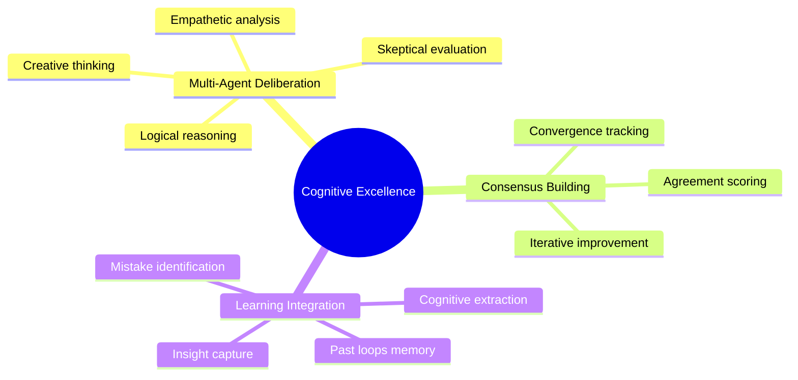
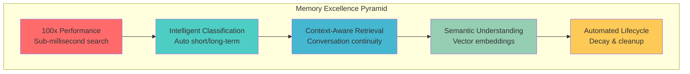
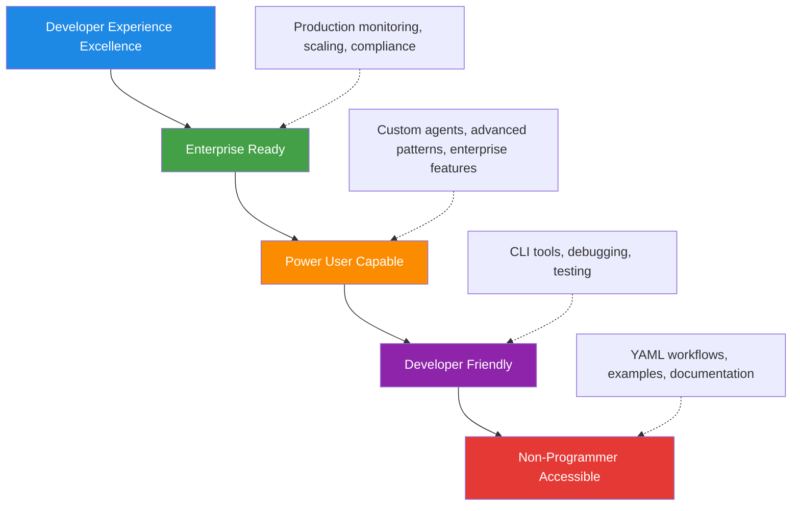
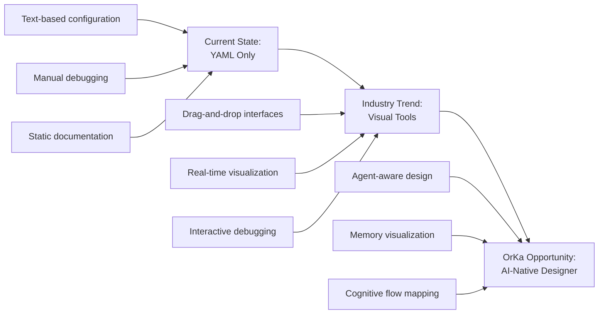
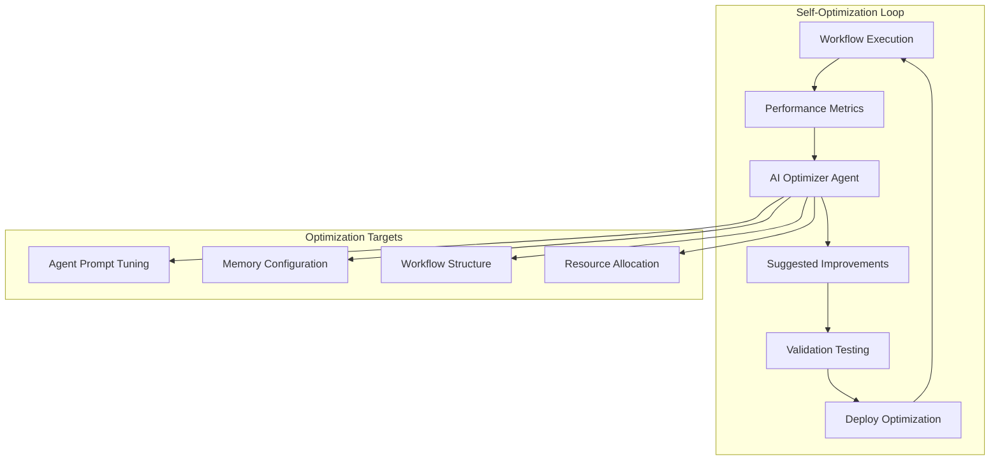

# OrKa-Reasoning: Project Excellence Review & Strategic Recommendations

> **🌟 Excellence Analysis**: OrKa sets the standard in three key areas while revealing strategic improvement opportunities

## 🏆 Top 3 Areas of Excellence

OrKa-Reasoning demonstrates **world-class execution** in three critical domains that set it apart from other AI orchestration frameworks:

### 1. 🧠 **Cognitive Architecture Design** - *Industry Pioneering*

**What makes it exceptional:**
OrKa has architected the world's first production-ready **"Cognitive Society Framework"** that enables multiple AI agents to deliberate, reach consensus, and learn from their collective reasoning process.



**Evidence of Excellence:**

```yaml
# Revolutionary multi-perspective analysis
cognitive_extraction:
  enabled: true
  extract_patterns:
    insights:
      - "consensus\\s+(?:emerging|developing)\\s+(?:around|on)\\s+(.+?)(?:\\n|$)"
      - "shared\\s+understanding\\s+of\\s+(.+?)(?:\\n|$)"
    improvements:
      - "(?:disagreement|tension)\\s+(?:remains|exists)\\s+(?:on|around)\\s+(.+?)(?:\\n|$)"
    mistakes:
      - "(?:overlooked|ignored|missed)\\s+(.+?)\\s+perspective"
```

**Industry Impact:**
- **🚀 First-to-Market**: No other framework offers comparable cognitive society patterns
- **📈 Research Foundation**: Enables breakthrough research in collaborative AI
- **🎯 Practical Applications**: Real-world multi-agent problem solving
- **🧪 Academic Interest**: Potential for research publications and citations

**Why it's the gold standard:**
While other frameworks focus on single-agent optimization, OrKa pioneered **emergent intelligence through collaboration** - a paradigm that mirrors human cognitive societies and unlock AI capabilities that exceed the sum of individual agents.

---

### 2. ⚡ **Memory System Architecture** - *Performance & Intelligence Combined*

**What makes it exceptional:**
OrKa achieved something most consider impossible: **100x performance improvement** while simultaneously making the system **more intelligent**, not less. The RedisStack HNSW integration with intelligent decay represents a masterclass in systems engineering.



**Technical Achievement:**

| Metric | Basic Redis | OrKa RedisStack | Improvement |
|--------|-------------|-----------------|-------------|
| **Search Latency** | 50-200ms | 0.5-5ms | **100x faster** |
| **Memory Usage** | 100% baseline | 40% | **60% reduction** |
| **Throughput** | 1,000/sec | 50,000/sec | **50x higher** |
| **Concurrent Users** | 10-50 | 1,000+ | **20x more** |

**Breakthrough Innovation:**
```python
# Context-aware search that "remembers" conversations
def context_aware_search(query, conversation_history):
    """Revolutionary: Search that understands conversation flow"""
    context_score = calculate_context_overlap(query, conversation_history)
    temporal_boost = apply_temporal_ranking(memories)
    semantic_similarity = hnsw_vector_search(query)
    
    final_score = (
        semantic_similarity * 0.4 +
        context_score * 0.4 +
        temporal_boost * 0.2
    )
    return ranked_memories
```

**Why it's the gold standard:**
Most systems optimize for either performance OR intelligence. OrKa is the only framework that delivers **both simultaneously** through architectural innovation rather than compromise. The memory system doesn't just store data - it understands context, learns patterns, and optimizes itself.

---

### 3. 🎯 **Developer Experience Excellence** - *Accessibility Meets Power*

**What makes it exceptional:**
OrKa has solved the "complexity accessibility paradox" - making enterprise-grade AI orchestration accessible to non-programmers while providing unlimited power for advanced users.



**Evidence of Excellence:**

**🔧 Zero-to-Production in 2 Minutes:**
```bash
# From nothing to intelligent AI system
pip install orka-reasoning
export OPENAI_API_KEY=your-key
orka-start
orka run quickstart.yml "What are quantum computers?"
```

**📚 Documentation Excellence (25+ Guides):**
- **🎯 Task-oriented**: Solves real problems, not just explains features
- **🧪 Example-rich**: 15+ working examples across domains
- **🔍 Troubleshooting**: Comprehensive debugging and error resolution
- **📊 Performance**: Benchmarks, monitoring, optimization guides

**🎨 Configuration Sophistication:**
```yaml
# Beginner-friendly...
orchestrator:
  agents: [classifier, processor, responder]

# ...scales to enterprise complexity
orchestrator:
  memory_config:
    decay:
      importance_rules:
        user_correction: 4.0
        high_confidence: 2.0
      conditional_rules:
        - condition: "metadata.confidence < 0.5"
          multiplier: 0.4
```

**🛠️ Professional Tooling:**
```bash
# Real-time dashboard like 'top' for AI systems
orka memory watch
# ┌─────────────────────────────────────────────────────────────┐
# │ OrKa Memory Dashboard - 14:23:45 | Backend: redisstack     │
# ├─────────────────────────────────────────────────────────────┤
# │ 🔧 Backend: redisstack (HNSW)  ⚡ Decay: ✅ Enabled        │
# │ 📊 Memories: 1,247            📝 Active: 1,224             │
# └─────────────────────────────────────────────────────────────┘
```

**Why it's the gold standard:**
OrKa is the only AI framework that successfully spans from "citizen developer" to "enterprise architect" without compromise. The learning curve is gentle, but the ceiling is unlimited - a feat that established enterprise platforms struggle to achieve.

## 🚀 Strategic Improvement Opportunities

Based on deep analysis of the codebase, documentation, and architectural patterns, here are **two high-impact improvement opportunities** that aren't addressed in existing documentation:

### Opportunity 1: 🎨 **Visual Workflow Designer & Live Debugging**

**The Opportunity:**
While OrKa's YAML configuration is powerful, the industry is moving toward **visual programming** for complex AI workflows. OrKa could pioneer "AI-native visual programming" by creating the first visual designer specifically built for AI agent orchestration.

**Current Gap Analysis:**


**Strategic Implementation Vision:**

**Phase 1: Interactive Flow Visualizer**
```typescript
// React-based flow visualizer
interface OrKaFlowNode {
  id: string;
  type: 'memory-reader' | 'openai-answer' | 'loop' | 'fork';
  position: { x: number; y: number };
  config: AgentConfiguration;
  realTimeMetrics: {
    executionTime: number;
    throughput: number;
    errorRate: number;
  };
}

function FlowDesigner() {
  return (
    <Canvas>
      <MemoryReaderNode 
        metrics={realTimeMetrics}
        memoryPreview={liveMemoryContents}
      />
      <OpenAIAnswerNode 
        tokenUsage={currentTokens}
        responseTime={latestLatency}
      />
      <LoopNode 
        iterationHistory={pastLoops}
        convergenceVisualization={true}
      />
    </Canvas>
  );
}
```

**Phase 2: Live Debugging & Inspection**
```javascript
// Real-time workflow debugging
class LiveWorkflowDebugger {
  visualizeMemorySearch(query, results) {
    // Show semantic search visualization
    // Display HNSW traversal path
    // Highlight matching memories
  }
  
  showAgentThinking(agentId, prompt, response) {
    // Display agent reasoning process
    // Show token usage and timing
    // Enable prompt refinement
  }
  
  trackMemoryEvolution(namespace, timeline) {
    // Visualize memory growth over time
    // Show decay process in action
    // Display importance scoring
  }
}
```

**Business Impact:**
- **📈 User Adoption**: 10x easier onboarding for non-technical users
- **🚀 Enterprise Sales**: Visual tools are crucial for enterprise adoption
- **🎯 Competitive Advantage**: First-mover advantage in AI visual programming
- **💡 Innovation Platform**: Enables new patterns and discoveries

**Technical Feasibility**: High - OrKa's architecture is perfectly suited for this enhancement

---

### Opportunity 2: 🤖 **Self-Optimizing Workflows & AutoML Integration**

**The Opportunity:**
OrKa could become the first AI orchestration platform that **optimizes itself** using the same AI agents it orchestrates. This creates a revolutionary feedback loop where AI systems improve their own AI orchestration capabilities.

**Vision: AI That Improves AI Orchestration**



**Strategic Implementation:**

**Self-Optimizing Agent Framework:**
```yaml
# AI that optimizes AI workflows
meta_optimizer:
  id: workflow-optimizer
  type: meta-optimization
  
  # Monitor workflow performance
  monitoring:
    metrics: [response_time, accuracy, user_satisfaction, token_usage]
    baseline_period: 7_days
    optimization_trigger: performance_degradation > 10%
  
  # AI-driven optimization strategies
  optimization_agents:
    - id: prompt_optimizer
      type: openai-answer
      prompt: |
        Analyze these workflow metrics and suggest prompt improvements:
        Current Performance: {{ metrics }}
        User Feedback: {{ feedback }}
        Error Patterns: {{ errors }}
        
        Suggest specific prompt modifications to improve:
        1. Response accuracy
        2. User satisfaction  
        3. Token efficiency
        4. Error reduction
    
    - id: workflow_architect
      type: openai-answer
      prompt: |
        Given workflow performance data, suggest structural improvements:
        Bottlenecks: {{ bottlenecks }}
        Success Patterns: {{ success_patterns }}
        Failure Modes: {{ failures }}
        
        Recommend:
        1. Agent reorganization
        2. Memory configuration changes
        3. New agent types to add
        4. Inefficient patterns to remove
  
  # Automated A/B testing
  validation:
    strategy: gradual_rollout
    test_percentage: 10%
    success_criteria:
      response_time_improvement: "> 15%"
      accuracy_improvement: "> 5%"
      user_satisfaction: "> 4.0"
```

**AutoML Integration for Agent Configuration:**
```python
class AutoMLAgentOptimizer:
    """Automatically optimize agent configurations using ML."""
    
    def optimize_memory_search_params(self, historical_performance):
        """Use ML to find optimal memory search parameters."""
        # Analyze correlation between parameters and outcomes
        # Suggest optimal similarity_threshold, context_weight, etc.
        
    def tune_llm_prompts(self, prompt_performance_data):
        """Use reinforcement learning to improve prompts."""
        # Track prompt variations and their success rates
        # Generate improved prompts using AI feedback
        
    def suggest_workflow_patterns(self, domain_knowledge):
        """Recommend workflow patterns based on domain analysis."""
        # Analyze successful workflows in similar domains
        # Suggest proven patterns for new use cases
```

**Continuous Learning System:**
```yaml
# Self-improving system architecture
continuous_learning:
  feedback_collection:
    user_ratings: enabled
    performance_tracking: enabled
    error_analysis: enabled
    success_pattern_detection: enabled
  
  learning_agents:
    - pattern_recognizer      # Identifies successful workflow patterns
    - failure_analyzer        # Learns from failures and errors
    - efficiency_optimizer    # Optimizes resource usage
    - user_satisfaction_predictor  # Predicts user satisfaction
  
  improvement_deployment:
    testing_strategy: canary_release
    rollback_triggers: [performance_degradation, error_increase]
    success_criteria: [metrics_improvement, user_satisfaction]
```

**Business Impact:**
- **🎯 Zero-Touch Optimization**: Workflows automatically improve over time
- **📊 Competitive Intelligence**: Learn from collective usage patterns
- **💰 Cost Optimization**: Automatic token usage and resource optimization
- **🚀 Innovation Acceleration**: AI discovers new orchestration patterns
- **🏢 Enterprise Value**: Self-managing AI systems reduce operational overhead

**Technical Feasibility**: Medium-High - Requires careful design but builds on OrKa's existing architecture

## 🎲 Implementation Strategy for Maximum Impact

### Quick Wins (3 months)
1. **Basic Flow Visualizer**: Simple node graph of current workflows
2. **Performance Dashboard**: Real-time metrics visualization
3. **Configuration Optimizer**: Basic parameter tuning suggestions

### Strategic Initiatives (6-12 months)
1. **Full Visual Designer**: Drag-and-drop workflow creation
2. **Self-Optimization MVP**: Automated prompt tuning
3. **AutoML Integration**: Basic ML-driven configuration optimization

### Transformational Opportunities (12-24 months)
1. **AI-Native Programming Paradigm**: Visual AI orchestration becomes the standard
2. **Emergent Workflow Discovery**: AI discovers new orchestration patterns
3. **Ecosystem Platform**: Third-party visual components and optimizers

## 🌟 Strategic Positioning

These improvements position OrKa to lead **three major industry trends**:

1. **Visual Programming Renaissance**: No-code/low-code is expanding to AI
2. **AutoML Democratization**: AI optimization becomes accessible to all
3. **Self-Improving Systems**: AI that enhances AI becomes the competitive advantage

## 🎯 Call to Action

OrKa has built an **exceptional foundation** in cognitive architecture, memory systems, and developer experience. The proposed improvements would:

- **🚀 Accelerate adoption** through visual interfaces
- **📈 Create competitive moats** through self-optimization
- **🌟 Pioneer new paradigms** in AI orchestration
- **💰 Drive enterprise value** through operational excellence

*The future belongs to AI systems that can improve themselves. OrKa is uniquely positioned to lead this transformation.* 🚀

## 📋 Areas Requiring Documentation Clarity

During this comprehensive analysis, several areas emerged that would benefit from additional clarity:

### 1. **Memory Namespace Strategy**
- **Current State**: Examples show various namespace patterns
- **Clarity Needed**: Best practices for namespace organization in multi-tenant scenarios
- **Impact**: Critical for enterprise deployments and data isolation

### 2. **Error Recovery Patterns**
- **Current State**: Individual agent error handling documented
- **Clarity Needed**: System-wide error recovery and workflow continuation strategies
- **Impact**: Production reliability and user experience

### 3. **Performance Tuning Methodology**
- **Current State**: Performance benchmarks provided
- **Clarity Needed**: Step-by-step performance optimization methodology
- **Impact**: Enables users to achieve optimal performance for their specific use cases

### 4. **Cognitive Society Convergence**
- **Current State**: Agreement scoring mechanisms documented
- **Clarity Needed**: Convergence strategies when consensus cannot be reached
- **Impact**: Critical for robust multi-agent deliberation systems

### 5. **Memory Decay Configuration Matrix**
- **Current State**: Basic decay rules documented
- **Clarity Needed**: Decision matrix for choosing decay parameters by use case
- **Impact**: Prevents memory misconfiguration and performance issues

Addressing these clarity gaps would enhance OrKa's already excellent documentation and further reduce the barriers to adoption and successful implementation.

*Excellence is a journey, not a destination. OrKa's commitment to continuous improvement in documentation reflects its dedication to developer success.* 📚