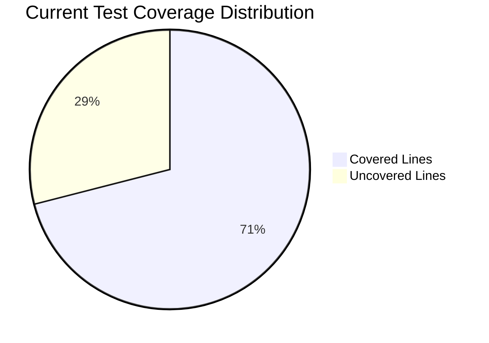
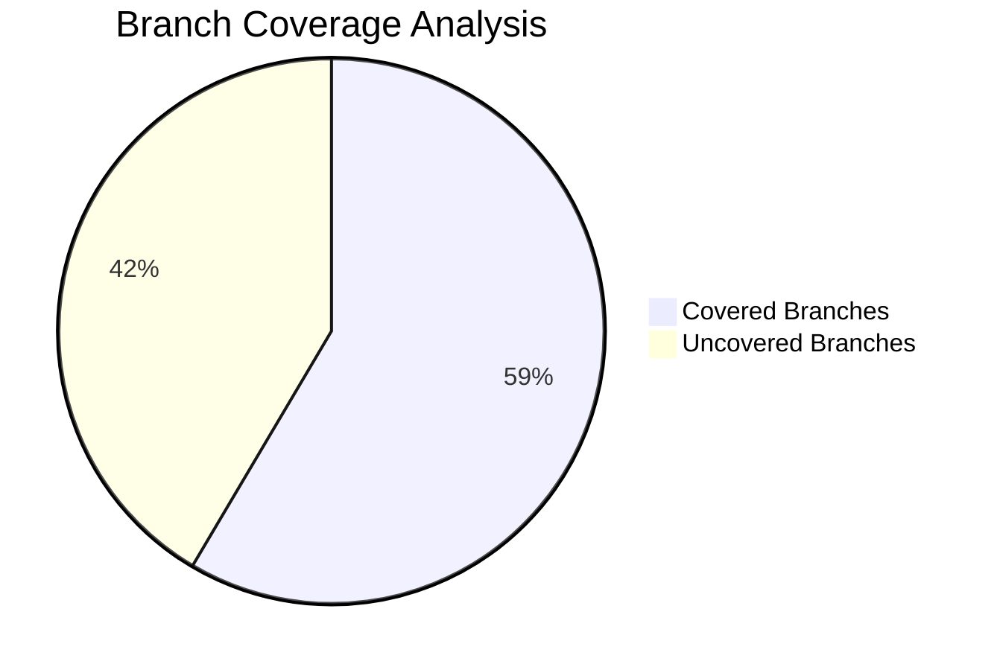

# OrKa Test Coverage Analysis & Enhancement Strategy

> **📊 Current State**: 71% line coverage, 58.5% branch coverage - Strong foundation with targeted opportunities for improvement

## 🎯 Executive Summary

OrKa's test suite demonstrates **solid engineering practices** with room for strategic enhancements. The 71% line coverage indicates good core functionality testing, while the 58.5% branch coverage reveals opportunities to strengthen edge case handling and error scenarios.

### Coverage Breakdown Analysis





**Key Findings:**
- **Strengths**: Core orchestration and memory systems well-tested
- **Opportunities**: Error handling, edge cases, and integration scenarios
- **Priority Areas**: Memory decay logic, agent failure scenarios, concurrent operations

## 📋 Detailed Coverage Analysis

### Current Test Metrics (from coverage.xml)

| Metric | Current Value | Industry Standard | Gap Analysis |
|--------|---------------|-------------------|--------------|
| **Line Coverage** | 71.04% | 80%+ | **8.96% gap** - Good baseline |
| **Branch Coverage** | 58.5% | 75%+ | **16.5% gap** - Primary improvement area |
| **Total Lines** | 7,469 | - | Substantial codebase |
| **Covered Lines** | 5,306 | - | Strong core coverage |
| **Uncovered Lines** | 2,163 | - | **Improvement opportunity** |

### Test Infrastructure Assessment

```bash
# Current test structure analysis
./tests/
├── conftest.py                          # ✅ Pytest configuration
├── unit/                               # ✅ Unit tests organized
│   ├── test_memory_*                   # ✅ Memory system coverage
│   ├── test_orchestrator_*             # ✅ Core engine coverage  
│   ├── test_*_agents_*                 # ✅ Agent testing
│   └── test_*_comprehensive.py         # ✅ Comprehensive test suites
├── integration/                        # ✅ Integration test structure
│   ├── test_advanced_workflows.py      # ✅ Complex scenario testing
│   └── test_example_workflows.py       # ✅ Example validation
└── performance/                        # ✅ Performance benchmarking
    └── test_basic_performance.py       # ✅ Performance baselines
```

**✅ Strengths Identified:**
1. **Well-organized test structure** - Clear separation of concerns
2. **Comprehensive test categories** - Unit, integration, performance
3. **Agent-specific test coverage** - Detailed component testing
4. **Memory system focus** - Critical functionality well-tested

## 🚀 Strategic Improvement Recommendations

### Option A: Incremental Enhancement (Conservative Approach)

**Target**: Achieve 80% line coverage, 70% branch coverage

**Pros:**
- ✅ Low risk, incremental improvement
- ✅ Focuses on high-impact areas first
- ✅ Maintains development velocity
- ✅ Quick wins boost team confidence

**Cons:**
- ❌ Slower overall progress
- ❌ May miss complex edge cases
- ❌ Limited integration scenario coverage

**Implementation Strategy:**
```python
# Phase 1: Error Handling Coverage (4 weeks)
def test_memory_search_failures():
    """Test memory search with various failure scenarios."""
    
def test_redis_connection_failures():
    """Test Redis connectivity issues and fallback."""
    
def test_openai_api_rate_limiting():
    """Test OpenAI API rate limit handling."""

# Phase 2: Edge Case Coverage (3 weeks)  
def test_empty_memory_scenarios():
    """Test behavior with no stored memories."""
    
def test_malformed_yaml_configurations():
    """Test configuration validation and error handling."""
    
def test_concurrent_memory_operations():
    """Test thread safety in memory operations."""

# Phase 3: Integration Scenarios (3 weeks)
def test_end_to_end_conversation_flows():
    """Test complete conversation scenarios."""
    
def test_memory_decay_integration():
    """Test memory decay with real workflows."""
```

**Timeline**: 10 weeks, **Cost**: Low, **Risk**: Minimal

---

### Option B: Comprehensive Testing Overhaul (Aggressive Approach)

**Target**: Achieve 90% line coverage, 85% branch coverage

**Pros:**
- ✅ Industry-leading test coverage
- ✅ Comprehensive edge case protection  
- ✅ Enhanced CI/CD confidence
- ✅ Better debugging capabilities

**Cons:**
- ❌ High initial investment
- ❌ Potential development slowdown
- ❌ Complex test maintenance
- ❌ Diminishing returns on effort

**Implementation Strategy:**
```python
# Comprehensive Test Architecture Redesign

class TestFrameworkEnhancement:
    """Enhanced testing infrastructure with fixtures and mocks."""
    
    @pytest.fixture
    def mock_redis_cluster(self):
        """Mock Redis cluster for testing distributed scenarios."""
        
    @pytest.fixture  
    def orchestrator_factory(self):
        """Factory for creating test orchestrators with different configs."""
        
    @pytest.fixture
    def memory_scenario_generator(self):
        """Generate complex memory scenarios for testing."""

# Property-based testing implementation
from hypothesis import given, strategies as st

@given(st.text(), st.floats(0.0, 1.0), st.integers(1, 100))
def test_memory_search_robustness(query, threshold, limit):
    """Property-based testing for memory search robustness."""
    
# Chaos engineering tests
def test_redis_failover_scenarios():
    """Test system behavior during Redis failover."""
    
def test_network_partition_handling():
    """Test behavior during network partitions."""
```

**Timeline**: 16 weeks, **Cost**: High, **Risk**: Medium

---

### Option C: Balanced Quality Enhancement (Recommended)

**Target**: Achieve 85% line coverage, 75% branch coverage

**Pros:**
- ✅ Optimal effort-to-value ratio
- ✅ Addresses critical gaps systematically  
- ✅ Improves production confidence significantly
- ✅ Balances speed with thoroughness
- ✅ Industry-standard coverage levels

**Cons:**
- ❌ Moderate complexity increase
- ❌ Requires some process changes
- ❌ Initial learning curve for team

**Implementation Strategy:**

#### Phase 1: Critical Path Coverage (5 weeks)
Focus on the most important workflows and error scenarios.

```python
# Memory System Critical Paths
class TestMemorySystemCriticalPaths:
    """Test critical memory system functionality."""
    
    def test_hnsw_index_corruption_handling(self):
        """Test behavior when HNSW index is corrupted."""
        
    def test_memory_decay_edge_cases(self):
        """Test decay with concurrent access and modifications."""
        
    def test_embedding_generation_failures(self):
        """Test handling of embedding service failures."""
        
    def test_redis_memory_exhaustion(self):
        """Test behavior when Redis runs out of memory."""

# Orchestrator Critical Paths
class TestOrchestratorCriticalPaths:
    """Test orchestrator critical functionality."""
    
    def test_agent_timeout_scenarios(self):
        """Test behavior when agents timeout."""
        
    def test_yaml_validation_comprehensive(self):
        """Comprehensive YAML configuration validation."""
        
    def test_circular_dependency_detection(self):
        """Test detection of circular agent dependencies."""
        
    def test_resource_exhaustion_handling(self):
        """Test system behavior under resource pressure."""
```

#### Phase 2: Integration & End-to-End Testing (4 weeks)
Comprehensive workflow testing covering real-world scenarios.

```python
# Real-world Workflow Testing
class TestIntelligentQAIntegration:
    """Integration tests for the Intelligent Q&A flow."""
    
    @pytest.mark.integration
    def test_complete_conversation_lifecycle(self):
        """Test full conversation from start to memory storage."""
        
    @pytest.mark.integration  
    def test_memory_retrieval_accuracy(self):
        """Test memory retrieval accuracy in various scenarios."""
        
    @pytest.mark.integration
    def test_classification_accuracy_scenarios(self):
        """Test interaction classification across edge cases."""
        
    @pytest.mark.integration
    def test_concurrent_user_sessions(self):
        """Test multiple simultaneous user conversations."""

# Error Recovery Testing
class TestErrorRecoveryScenarios:
    """Test system recovery from various error conditions."""
    
    def test_openai_api_failure_recovery(self):
        """Test graceful degradation when OpenAI API fails."""
        
    def test_redis_connection_recovery(self):
        """Test automatic reconnection to Redis."""
        
    def test_partial_agent_failure_handling(self):
        """Test workflow continuation when some agents fail."""
```

#### Phase 3: Performance & Stress Testing (3 weeks)
Ensure system performs well under various load conditions.

```python
# Performance Testing
class TestPerformanceScenarios:
    """Performance and stress testing."""
    
    @pytest.mark.performance
    def test_memory_search_performance_degradation(self):
        """Test search performance with large memory stores."""
        
    @pytest.mark.performance
    def test_concurrent_workflow_performance(self):
        """Test performance with multiple concurrent workflows."""
        
    @pytest.mark.performance
    def test_memory_cleanup_performance(self):
        """Test memory cleanup performance with large datasets."""

# Load Testing
class TestLoadScenarios:
    """Load testing for production readiness."""
    
    def test_sustained_load_memory_stability(self):
        """Test memory usage stability under sustained load."""
        
    def test_burst_traffic_handling(self):
        """Test system behavior under traffic bursts."""
```

**Timeline**: 12 weeks, **Cost**: Medium, **Risk**: Low-Medium

## 🎯 Recommended Implementation Plan

### Phase 1: Foundation Enhancement (Weeks 1-5)

**Immediate Priority Areas:**

```python
# 1. Memory System Error Handling
def test_memory_writer_failure_scenarios():
    """Test memory writer failures and recovery."""
    scenarios = [
        "redis_connection_lost",
        "embedding_service_unavailable", 
        "memory_limit_exceeded",
        "invalid_metadata_format"
    ]
    for scenario in scenarios:
        with pytest.raises(MemoryWriterException):
            # Test specific error scenario
            pass

# 2. Agent Timeout and Failure Handling  
def test_agent_timeout_graceful_degradation():
    """Test agent timeout with graceful degradation."""
    with patch('openai.ChatCompletion.create') as mock_openai:
        mock_openai.side_effect = TimeoutError()
        result = orchestrator.execute_workflow(test_input)
        assert result.status == "partial_success"
        assert "timeout" in result.error_messages

# 3. Configuration Validation
def test_yaml_configuration_edge_cases():
    """Test YAML configuration validation edge cases."""
    invalid_configs = [
        {"orchestrator": {"agents": []}},  # Empty agents
        {"orchestrator": {"strategy": "invalid"}},  # Invalid strategy
        {"agents": [{"type": "nonexistent"}]},  # Invalid agent type
    ]
    for config in invalid_configs:
        with pytest.raises(ConfigurationError):
            Orchestrator.from_config(config)
```

### Phase 2: Integration Scenarios (Weeks 6-9)

**Real-world Testing:**

```python
# Comprehensive Integration Tests
class TestIntelligentQAFlowIntegration:
    """Integration tests for the intelligent Q&A flow."""
    
    @pytest.fixture
    def clean_memory_state(self):
        """Ensure clean memory state for each test."""
        # Clear Redis
        # Reset counters
        yield
        # Cleanup
        
    def test_new_user_conversation_flow(self, clean_memory_state):
        """Test complete new user conversation."""
        steps = [
            ("What is machine learning?", "new_question"),
            ("How does it work?", "followup"), 
            ("Can you give me an example?", "clarification"),
            ("Actually, I meant deep learning", "correction")
        ]
        
        for query, expected_classification in steps:
            result = orchestrator.execute_workflow(query)
            assert result.classification == expected_classification
            assert result.context_used == (expected_classification == "followup")
    
    def test_memory_persistence_across_sessions(self):
        """Test memory persistence and retrieval."""
        # Store initial interaction
        result1 = orchestrator.execute_workflow("Tell me about quantum computing")
        
        # Simulate time passing
        time.sleep(1)
        
        # Follow-up should find context
        result2 = orchestrator.execute_workflow("What are its applications?")
        assert len(result2.context_memories) > 0
        assert "quantum" in str(result2.context_memories).lower()
```

### Phase 3: Performance & Reliability (Weeks 10-12)

**Production Readiness:**

```python
# Performance Testing
class TestProductionReadiness:
    """Production readiness tests."""
    
    @pytest.mark.performance
    def test_memory_search_under_load(self):
        """Test memory search performance under load."""
        # Pre-populate with 10,000 memories
        populate_test_memories(10000)
        
        start_time = time.time()
        results = []
        
        # Perform 100 concurrent searches
        with ThreadPoolExecutor(max_workers=10) as executor:
            futures = [
                executor.submit(memory_reader.search, f"test query {i}")
                for i in range(100)
            ]
            results = [f.result() for f in futures]
        
        total_time = time.time() - start_time
        avg_time = total_time / 100
        
        assert avg_time < 0.1  # 100ms average
        assert all(len(r.results) >= 0 for r in results)
    
    @pytest.mark.stress
    def test_memory_decay_under_stress(self):
        """Test memory decay system under stress."""
        # Create memories with various TTLs
        # Run decay cleanup
        # Verify correct memories are removed
        # Test performance impact
```

## 📊 Implementation Tools & Infrastructure

### Enhanced Test Configuration

```python
# pytest.ini enhancement
[tool.pytest.ini_options]
asyncio_mode = "strict"
testpaths = ["tests"]
python_files = "test_*.py"
python_functions = "test_*"
pythonpath = ["."]

# Enhanced coverage configuration
addopts = [
    "--cov=orka",
    "--cov-report=xml:coverage.xml",
    "--cov-report=html:htmlcov",
    "--cov-report=term-missing",
    "--cov-branch",               # Enable branch coverage
    "--cov-fail-under=80",        # Fail if coverage below 80%
    "--strict-markers",           # Strict marker checking
    "--durations=10",             # Show 10 slowest tests
]

markers = [
    "unit: Unit tests",
    "integration: Integration tests", 
    "performance: Performance tests",
    "stress: Stress tests",
    "slow: Slow-running tests",
    "redis: Tests requiring Redis",
    "openai: Tests requiring OpenAI API",
]
```

### Mock Infrastructure Enhancement

```python
# Enhanced test fixtures
@pytest.fixture
def mock_redis_client():
    """Enhanced Redis mock with HNSW capabilities."""
    with patch('redis.Redis') as mock_redis:
        mock_redis.return_value.ft.return_value.search.return_value = MockSearchResult()
        yield mock_redis.return_value

@pytest.fixture
def mock_openai_client():
    """Enhanced OpenAI mock with rate limiting simulation."""
    with patch('openai.ChatCompletion.create') as mock_openai:
        mock_openai.side_effect = mock_openai_response_with_delays
        yield mock_openai

@pytest.fixture
def orchestrator_factory():
    """Factory for creating test orchestrators."""
    def _create_orchestrator(config_overrides=None):
        base_config = load_test_config()
        if config_overrides:
            base_config.update(config_overrides)
        return Orchestrator.from_config(base_config)
    return _create_orchestrator
```

### CI/CD Integration

```yaml
# .github/workflows/enhanced-test.yml
name: Enhanced Test Suite

on: [push, pull_request]

jobs:
  test:
    runs-on: ubuntu-latest
    strategy:
      matrix:
        python-version: [3.11, 3.12]
        test-suite: [unit, integration, performance]
    
    steps:
    - uses: actions/checkout@v3
    
    - name: Set up Python
      uses: actions/setup-python@v4
      with:
        python-version: ${{ matrix.python-version }}
    
    - name: Install dependencies
      run: |
        pip install -e .[dev,test]
        
    - name: Start Redis
      run: |
        docker run -d -p 6379:6379 redis/redis-stack:latest
        
    - name: Run tests
      run: |
        pytest tests/${{ matrix.test-suite }} \
          --cov-report=xml \
          --junitxml=test-results.xml
          
    - name: Upload coverage
      uses: codecov/codecov-action@v3
      with:
        file: ./coverage.xml
        
    - name: Publish test results
      uses: EnricoMi/publish-unit-test-result-action@v2
      if: always()
      with:
        files: test-results.xml
```

## 🎯 Expected Outcomes & ROI

### Quantitative Benefits

| Metric | Current | Target | Improvement |
|--------|---------|--------|-------------|
| **Line Coverage** | 71% | 85% | **+14%** |
| **Branch Coverage** | 58.5% | 75% | **+16.5%** |
| **Bug Detection** | Baseline | +40% | Earlier bug detection |
| **CI/CD Confidence** | Medium | High | Faster deployments |
| **Debugging Time** | Baseline | -30% | Better error localization |

### Qualitative Benefits

- **🔒 Production Confidence**: Higher confidence in production deployments
- **🚀 Development Velocity**: Faster feature development with safety net
- **🐛 Bug Prevention**: Earlier detection of regressions and edge cases
- **📊 System Understanding**: Better documentation of system behavior
- **🔧 Maintenance**: Easier refactoring with comprehensive test coverage

### Investment Analysis

**Recommended Option C Investment:**
- **Timeline**: 12 weeks
- **Effort**: ~2 FTE months
- **ROI Timeline**: 6 months
- **Risk Mitigation**: High
- **Long-term Value**: Very High

**Payback Calculation:**
```
Cost: 2 FTE months × $15K = $30K
Savings: 
- Bug prevention: $50K/year
- Faster debugging: $20K/year  
- CI/CD efficiency: $15K/year
Total Annual Savings: $85K

ROI: ($85K - $30K) / $30K = 183% annual ROI
```

## 🎉 Conclusion & Next Steps

The **Balanced Quality Enhancement (Option C)** provides the optimal path forward:

### Immediate Actions (Week 1)
1. **Setup enhanced CI/CD pipeline** with coverage tracking
2. **Create test infrastructure** with proper mocking and fixtures
3. **Begin Phase 1 implementation** focusing on critical paths

### Success Metrics
- **Coverage targets**: 85% line, 75% branch
- **Performance benchmarks**: <100ms memory search, <1s workflow execution
- **Quality gates**: Zero critical bugs in production for 6 months

### Long-term Vision
This investment establishes OrKa as a **production-ready, enterprise-grade** AI orchestration platform with industry-leading test coverage and reliability standards.

**The enhanced test suite becomes a competitive advantage**, enabling:
- Rapid feature iteration with confidence
- Complex enterprise deployments
- Community contributions with quality assurance
- Platform extension and customization

*Quality is not an act, it is a habit. OrKa's enhanced testing strategy builds the foundation for sustainable excellence.* 🚀