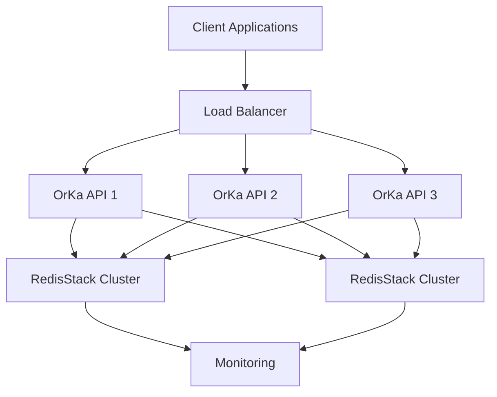

# OrKa Production Best Practices

> **Last Updated:** 22 November 2025  
> **Status:** 🟢 Current  
> **Related:** [Security](security.md) | [Observability](observability.md) | [Runtime Modes](runtime-modes.md) | [Architecture](architecture.md) | [INDEX](index.md)

This guide covers best practices for deploying and operating OrKa in production environments, focusing on performance, reliability, and maintainability.

## Table of Contents

1. [Architecture](#architecture)
2. [Performance](#performance)
3. [Memory Management](#memory-management)
4. [Security](#security)
5. [Monitoring](#monitoring)
6. [Deployment](#deployment)
7. [Operations](#operations)
8. [Development](#development)

## Architecture

### Component Layout



### Best Practices

1. **High Availability**
   - Deploy multiple OrKa instances
   - Use load balancers for distribution
   - Implement proper health checks
   - Set up automatic failover

2. **Scalability**
   - Horizontal scaling for API servers
   - RedisStack cluster for memory
   - RedisStack for memory and vector search
   - Separate compute and storage

3. **Reliability**
   - Circuit breakers for external services
   - Retry mechanisms with backoff
   - Graceful degradation strategies
   - Comprehensive error handling

## Performance

### RedisStack Optimization

1. **HNSW Configuration**
   ```yaml
   memory_config:
     enable_hnsw: true
     vector_params:
       M: 16                  # Balance between speed and accuracy
       ef_construction: 200   # Higher = better index, slower builds
       ef_runtime: 10        # Higher = better search, more CPU
   ```

2. **Memory Settings**
   ```bash
   # redis.conf
   maxmemory 8gb
   maxmemory-policy allkeys-lru
   save 900 1
   save 300 10
   save 60 10000
   ```

3. **Connection Pooling**
   ```python
   memory_config:
     pool_size: 20
     pool_timeout: 30
     retry_on_timeout: true
   ```

### Workflow Optimization

1. **Parallel Processing**
   ```yaml
   orchestrator:
     strategy: parallel
     max_concurrent: 50
     batch_size: 10
   ```

2. **Resource Limits**
   ```yaml
   agents:
     - id: heavy_processor
       type: openai-answer
       resources:
         memory_limit: 1G
         cpu_limit: 2
   ```

## Memory Management

### Decay Configuration

```yaml
memory_config:
  decay:
    enabled: true
    default_short_term_hours: 2
    default_long_term_hours: 168
    check_interval_minutes: 30
    
    # Importance rules
    importance_rules:
      user_correction: 3.0
      positive_feedback: 2.0
      successful_answer: 1.5
      routine_query: 0.8
```

### Namespace Organization

```yaml
memory_config:
  namespaces:
    user_data:
      retention_days: 30
      backup_enabled: true
    system_logs:
      retention_days: 7
      compression: true
    analytics:
      retention_days: 90
      aggregation: true
```

### Backup Strategy

```bash
# Automated backup script
#!/bin/bash
DATE=$(date +%Y%m%d)
redis-cli SAVE
tar czf backup_$DATE.tar.gz dump.rdb
aws s3 cp backup_$DATE.tar.gz s3://backups/
```

## Security

### Authentication

```yaml
security_config:
  auth:
    type: jwt
    issuer: orka-auth
    audience: orka-api
    expiry: 1h
```

### API Security

```yaml
api_config:
  rate_limit:
    requests: 1000
    per_minute: true
  cors:
    allowed_origins: ["https://app.example.com"]
    allowed_methods: ["GET", "POST"]
```

### Data Protection

```yaml
security_config:
  encryption:
    at_rest: true
    in_transit: true
    key_rotation: 30d
```

## Monitoring

### Metrics Collection

```yaml
monitoring_config:
  metrics:
    enabled: true
    interval: 15s
    exporters:
      - prometheus
      - datadog
```

### Key Metrics

1. **System Health**
   - CPU usage
   - Memory utilization
   - Disk I/O
   - Network traffic

2. **Application Metrics**
   - Request latency
   - Error rates
   - Queue depth
   - Active workflows

3. **Memory Metrics**
   - Vector search latency
   - Index size
   - Cache hit rate
   - Memory fragmentation

### Alerting

```yaml
alerts_config:
  rules:
    - name: high_latency
      condition: latency > 500ms
      duration: 5m
      severity: warning
    
    - name: error_spike
      condition: error_rate > 5%
      duration: 1m
      severity: critical
```

## Deployment

### Docker Compose Production

```yaml
version: '3.8'
services:
  redis-stack:
    image: redis/redis-stack:latest
    command: redis-stack-server --save 60 1000
    volumes:
      - redis_data:/data
    deploy:
      resources:
        limits:
          memory: 8G
        reservations:
          memory: 4G

  orka:
    image: marcosomma/orka:latest
    environment:
      - REDIS_URL=redis://redis-stack:6380/0
      - ORKA_MEMORY_BACKEND=redisstack
      - ORKA_MAX_CONCURRENT_REQUESTS=100
    deploy:
      replicas: 3
      update_config:
        parallelism: 1
        delay: 10s
      resources:
        limits:
          memory: 2G
          cpus: '2'

  monitoring:
    image: marcosomma/orka-monitor:latest
    ports:
      - "9090:9090"
    volumes:
      - monitoring_data:/data
```

### Kubernetes Deployment

```yaml
apiVersion: apps/v1
kind: Deployment
metadata:
  name: orka-api
spec:
  replicas: 3
  template:
    spec:
      containers:
      - name: orka
        image: marcosomma/orka:latest
        resources:
          requests:
            memory: "1Gi"
            cpu: "500m"
          limits:
            memory: "2Gi"
            cpu: "2"
        readinessProbe:
          httpGet:
            path: /health
            port: 8000
        livenessProbe:
          httpGet:
            path: /health
            port: 8000
```

## Operations

### Maintenance Procedures

1. **Index Optimization**
   ```bash
   # Schedule during low traffic
   redis-cli FT.OPTIMIZE orka:mem:idx
   ```

2. **Memory Cleanup**
   ```bash
   # Regular cleanup
   orka memory cleanup --dry-run
   orka memory cleanup
   ```

3. **Backup Verification**
   ```bash
   # Weekly backup test
   orka backup verify
   ```

### Scaling Procedures

1. **Add RedisStack Node**
   ```bash
   # 1. Start new node
   docker run -d redis/redis-stack
   
   # 2. Add to cluster
   redis-cli CLUSTER MEET
   
   # 3. Rebalance
   redis-cli CLUSTER REBALANCE
   ```

2. **Scale OrKa API**
   ```bash
   # Kubernetes
   kubectl scale deployment orka-api --replicas=5
   
   # Docker Swarm
   docker service scale orka_api=5
   ```

## Development

### Code Organization

```
orka/
  ├── api/           # API endpoints
  ├── core/          # Core logic
  ├── memory/        # Memory system
  ├── agents/        # AI agents
  ├── nodes/         # Workflow nodes
  └── utils/         # Utilities
```

### Testing Strategy

1. **Unit Tests**
   ```bash
   # Run with coverage
   pytest --cov=orka tests/unit/
   ```

2. **Integration Tests**
   ```bash
   # Test with real services
   pytest tests/integration/
   ```

3. **Performance Tests**
   ```bash
   # Load testing
   locust -f tests/performance/locustfile.py
   ```

### Logging Best Practices

```python
# Structured logging
logger.info("Memory operation completed", extra={
    "operation": "vector_search",
    "namespace": namespace,
    "duration_ms": duration,
    "results_count": len(results)
})
```

### Error Handling

```python
try:
    result = memory.search(query)
except RedisError as e:
    logger.error("Redis search failed", exc_info=e)
    # Fallback to basic search
    result = memory.basic_search(query)
except Exception as e:
    logger.critical("Unhandled error", exc_info=e)
    raise
```

## Additional Resources

- [Security Guide](./security.md)
- [API Reference](./api-reference.md)
- [Monitoring Guide](./observability.md)
- [Troubleshooting Guide](./troubleshooting.md)
---
← [GraphScout](GRAPH_SCOUT_AGENT.md) | [📚 INDEX](index.md) | [Testing](TESTING.md) →
